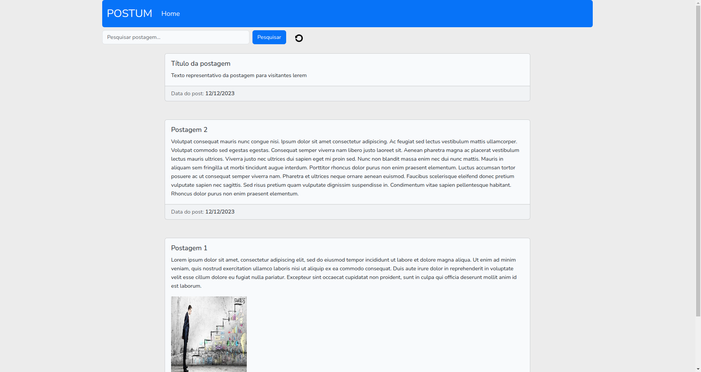
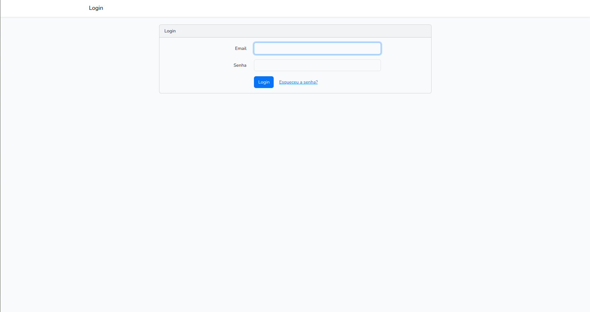
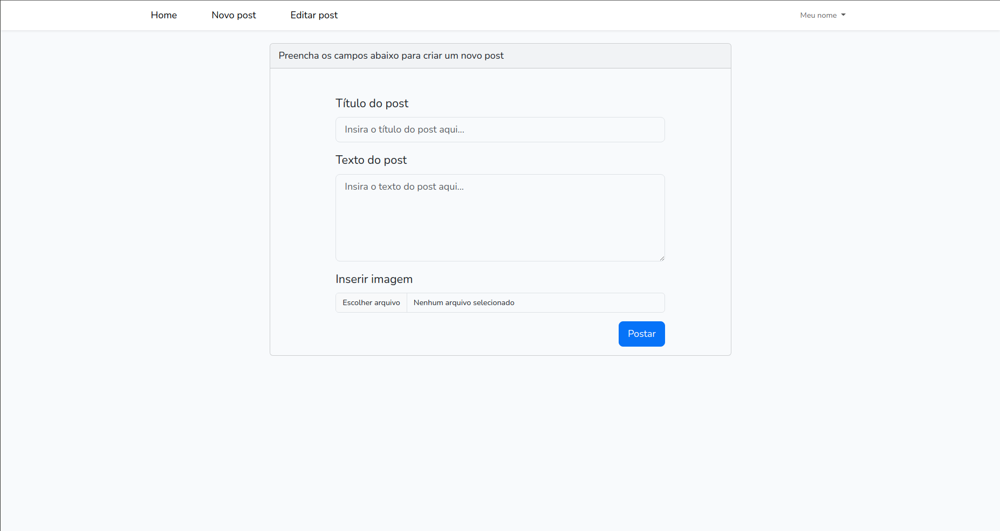
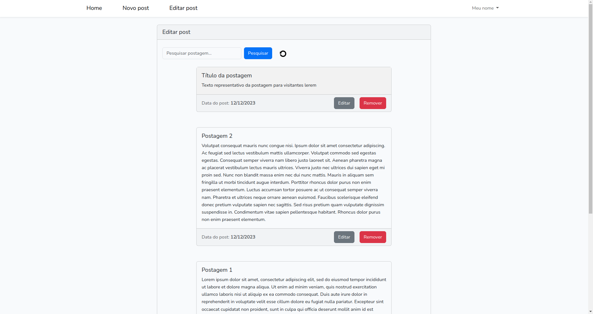

# Postum
Este projeto tem como propósito o estudo e aperfeiçoamento no framework Laravel e VUE.JS, portanto está livre para ser usado como estudo ou qualquer outra aplicação.

O postum é um pequeno CMS que permite ao usuário admin criar postagens com título, texto e imagem para apresentação ao leitor, basicamente isso. O admin é o único usuário possível neste CMS. Para realizar o primeiro login com sucesso e criar suas primeiras postagens, acesse o endereço: [http://localhost:8000/login](URL) e use as seguintes credenciais:

Login: default@default.com

Senha: default123

Para acessar a tela de admin e criar, editar e remover suas postagens, acesse a url:
[http://localhost:8000/admin](URL)


## Capturas de tela 🖥️

Tela Home:


Tela de login:


Criação de novo post:


Edição de post:



## Instalação 🛠️

Clonagem de repositório:

```bash
    git clone https://github.com/DevNetinho/cp-cms.git
```
   

Instalação de dependências do Laravel e do Vue com os comandos:

```bash
    composer install    

    npm install
```

Executar as migrations:

```bash
    php artisan migrate
```

Executar as Seeders:
```bash
    php artisan db:seed
```

Compilar os arquivos Vue e iniciar o servidor Laravel:

```bash
    npm run dev

    php artisan serve
```
## Aprendizados 📚

Meus principais aprendizados neste projeto incluem: Aplicação da biblioteca VueX para interceptar requests e criar variáveis globais no VueJS, Criação de 
API REST com o Laravel possibilitanto assim uma aplicação FullStack com Laravel e VUEJS, prática na criação de components Vue dinâmicos e utilização da biblioteca axios no Vue para requisições na API criada.